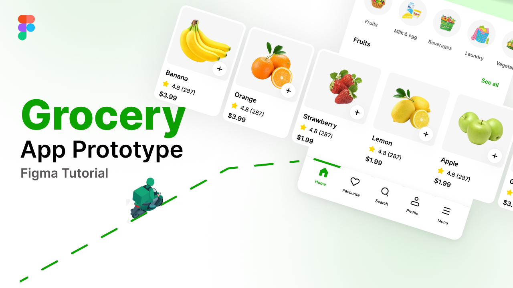
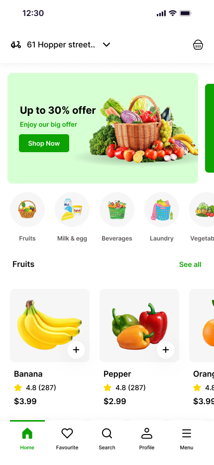
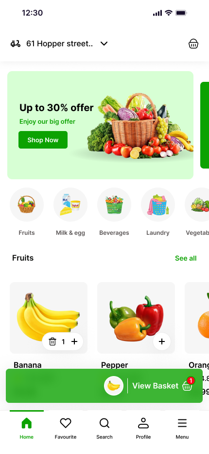

# 🛒 Grabber Grocery App

<p align="center">
  
</p>

<p align="center">
A modern Flutter grocery shopping application that provides a fast, intuitive, and seamless shopping experience with a clean UI and scalable architecture.
</p>

<p align="center">


</p>

---

## ✨ Features

- 🔐 User Authentication
- 🛍 Browse grocery products
- 🔎 Search products
- ❤️ Wishlist management
- 🛒 Shopping cart
- 💳 Checkout process
- 📦 Order tracking
- 👤 User profile
- 🌙 Clean and responsive UI
- ⚡ High-performance Flutter application

---

## 📱 Screenshots

| Home | Product Details |
|------|-----------------|
|  |  |

---

## 🏗 Architecture

This project follows a clean and scalable architecture with clear separation of concerns.

```
lib/
│
├── core/
├── features/
│   ├── authentication/
│   ├── home/
│   ├── cart/
│   ├── wishlist/
│   ├── profile/
│   └── checkout/
│
├── shared/
└── main.dart
```

---

## 🛠 Built With

- Flutter
- Dart
- Firebase (if used)
- Provider / Bloc / Riverpod
- REST API
- Shared Preferences
- Dio / HTTP

---

## 🚀 Getting Started

### Clone Repository

```bash
git clone https://github.com/USERNAME/grabber_grocery_app.git
```

### Install Packages

```bash
flutter pub get
```

### Run the App

```bash
flutter run
```

---

## 📂 Project Structure

```
lib
├── core
├── features
├── models
├── services
├── widgets
└── main.dart
```

---

## 🎯 Future Improvements

- Push Notifications
- Payment Gateway
- Dark Mode
- Multi-language Support
- Coupons & Offers
- Admin Dashboard

---

## 🤝 Contributing

Contributions are welcome.

Fork the repository, create a feature branch, and submit a Pull Request.

---

## 📄 License

This project is licensed under the MIT License.

---

## 👨‍💻 Author

**Amir Yousry**

Flutter Developer

GitHub: https://github.com/amir-yousry

---

⭐ If you find this project useful, consider giving it a star.
